# Kronos EAM - Enterprise Asset Management for Renewable Energy

<div align="center">
  
  **Simplifying Regulatory Compliance for Italian Renewable Energy Assets**
  
  [](https://github.com/Bloom79/kronos-eam/actions/workflows/deploy.yml)
  [](https://github.com/Bloom79/kronos-eam/actions/workflows/ci.yml)
  [](LICENSE)
  [](https://github.com/Bloom79/kronos-eam/releases)
</div>

---

## 🌟 The Challenge

Managing renewable energy assets in Italy involves navigating a complex web of bureaucratic requirements across multiple government agencies. Plant operators must interact with:

- **Terna** (GAUDÌ system) for grid connection and plant registration
- **GSE** (Energy Services Manager) for incentive management and conventions
- **DSO** (Distribution System Operators) for connection requests and technical compliance
- **Agenzia delle Dogane** (Customs Agency) for electric workshop licenses
- **Local Authorities** for permits and authorizations

Each interaction has strict deadlines, complex procedures, and severe penalties for non-compliance. Missing a single deadline can result in thousands of euros in fines or loss of incentives.


## 💡 Our Solution

**Kronos EAM** is a cloud-native SaaS platform that transforms how renewable energy assets are managed in Italy. Designed for multiple stakeholders - Administrators, Energy Managers, Technicians, and Plant Owners - we provide comprehensive tools tailored to each role:

### 👥 Multi-User Platform
- **Administrators**: Full system control, user management, multi-tenant configuration
- **Energy Managers**: Portfolio oversight, analytics, compliance tracking
- **Technicians**: Mobile app, field operations, task management
- **Plant Owners**: Real-time monitoring, cost visibility, performance reports

### 🚀 Smart Compliance Assistant
- **80% reduction** in manual administrative work
- Pre-filled forms and guided workflows for all government portals
- Intelligent document generation with all required data
- Step-by-step navigation assistance for complex procedures

### 📅 Proactive Deadline Management
- Never miss another compliance deadline
- Automated alerts 90, 60, and 30 days before critical dates
- Integrated calendar with all regulatory obligations
- Task prioritization based on urgency and impact

### 📊 Centralized Asset Registry
- Single source of truth for all plant documentation
- Complete audit trail of all interactions with authorities
- Version control for regulatory documents
- Multi-tenant architecture for portfolio management

### 🤖 Intelligent Automation
- Automated data extraction from government portals
- Smart form pre-filling with validated data
- E.D.I. file generation for customs declarations
- API integration where available (Terna, E-Distribuzione)

```mermaid
graph LR
    subgraph "Kronos EAM Solution - Unified Collaboration"
        Admin2[Administrator] -->|Configures| K[Kronos EAM Platform]
        EM2[Energy Manager] -->|Monitors| K
        Tech2[Technician] -->|Updates| K
        Owner2[Plant Owner] -->|Views| K
        
        K -->|Automated| T2[Terna API]
        K -->|Smart Forms| G2[GSE Portal]
        K -->|B2B Integration| D2[DSO Systems]
        K -->|EDI Generation| A2[Agenzia Dogane]
        
        K -->|Manages| CAL[Smart Calendar]
        K -->|Stores| DOC[Document Vault]
        K -->|Tracks| AUD[Audit Trail]
        
        CAL -->|Alerts All Users| OK[✓ Compliance]
        DOC -->|Shared Access| OK
        AUD -->|Full Transparency| OK
        
        Admin2 -.->|Full Control| OK
        EM2 -.->|Analytics| OK
        Tech2 -.->|Mobile Access| OK
        Owner2 -.->|Real-time View| OK
    end
    
    style Admin2 fill:#e74c3c
    style EM2 fill:#3498db
    style Tech2 fill:#2ecc71
    style Owner2 fill:#f39c12
    style K fill:#4ecdc4
    style OK fill:#95e1d3
    style CAL fill:#f6e58d
    style DOC fill:#7bed9f
```



## 🤝 How Users Collaborate in Kronos EAM


## 🎯 Key Benefits

### For Administrators
- **Complete Control**: Manage multiple organizations from a single dashboard
- **User Management**: Create, modify, and control user permissions across teams
- **System Customization**: Configure workflows and integrations to match business needs
- **Usage Analytics**: Monitor platform usage and generate billing reports

### For Energy Managers
- **Portfolio Overview**: Monitor all plants from a single interface
- **Proactive Management**: Receive alerts before deadlines approach
- **Performance Analytics**: Track KPIs and generate stakeholder reports
- **Task Delegation**: Assign and track field operations efficiently

### For Technicians
- **Mobile First**: Access everything needed from smartphone or tablet
- **Offline Capability**: Work without internet, sync when connected
- **Guided Procedures**: Step-by-step instructions for complex tasks
- **Quick Updates**: One-tap status updates from the field

### For Plant Owners
- **Real-time Visibility**: 24/7 access to plant compliance status
- **Cost Control**: Track and analyze compliance-related expenses
- **Risk Mitigation**: Avoid penalties with proactive notifications
- **Document Access**: Secure repository of all plant documentation

## 🏗️ Use Cases

### New Plant Activation
Complete end-to-end support for bringing new renewable energy plants online:

```mermaid
timeline
    title New Plant Activation Workflow with Kronos EAM
    
    Week 1-2    : DSO Connection Request
                : TICA Documentation
                : Initial Assessment
    
    Week 3-4    : GAUDÌ Registration
                : Terna Integration
                : Technical Data Entry
    
    Week 5-6    : GSE Convention Setup
                : RID Activation
                : SSP Configuration
    
    Week 7-8    : Customs License
                : EDI File Generation
                : Final Approvals
```



### Recurring Compliance
Never miss critical annual obligations:


### Portfolio Management
Efficiently manage multiple plants:
- Consolidated compliance dashboard
- Bulk operations for common tasks
- Portfolio-wide deadline overview
- Standardized document templates

## 🛡️ Security & Compliance

- **GDPR Compliant** with full data protection
- **Multi-tenant isolation** ensuring data segregation
- **Role-based access control** (RBAC) with granular permissions
- **Complete audit trails** for all activities
- **Encrypted data** at rest and in transit
- **Regular security audits** and penetration testing

## 🚀 Quick Start

### Cloud Deployment
The platform is available as a fully managed SaaS solution. Contact our sales team for a demo.

### Local Development

```bash
# Clone the repository
git clone https://github.com/Bloom79/kronos-eam.git
cd kronos-eam

# Start all services
cd deploy
./manage-services.sh
# Select option 1: Start all services locally
```

Visit http://localhost:3000 to access the application.

**Demo credentials:**
- Email: `demo@kronos-eam.local`
- Password: `Demo2024!`

## 📚 Documentation

- [Architecture Overview](docs/architecture.md) - System design and components
- [Getting Started Guide](docs/getting-started.md) - Installation and setup
- [API Reference](docs/api-reference.md) - REST API documentation
- [Deployment Guide](docs/deployment-complete.md) - Production deployment
- [Database Architecture](docs/database-architecture.md) - Database design and schema
- [Testing Guide](docs/testing-guide.md) - Testing procedures

## 🏛️ Technical Architecture

Kronos EAM is built on modern cloud-native principles:


### Technology Stack
- **Frontend**: React 18 with TypeScript, Material-UI v5, Redux Toolkit
- **Backend**: Python FastAPI with async support, SQLAlchemy ORM
- **Database**: PostgreSQL 14 for structured data, Redis for caching
- **Infrastructure**: Docker, Kubernetes, Google Cloud Platform
- **AI/ML**: Document intelligence for form extraction
- **Security**: JWT authentication, API key management, RBAC

### Key Features
- **Multi-Tenant Architecture**: Complete data isolation per organization
- **Real-time Updates**: WebSocket connections for live notifications
- **Scalable Design**: Horizontal scaling with load balancing
- **API-First**: RESTful APIs with OpenAPI documentation
- **Microservices Ready**: Modular design for future expansion

## 👥 Platform User Profiles

### Different Roles, Different Needs


### Use Cases by Profile

#### 🔴 **Administrator**
- **Multi-tenant Management**: Configure and manage multiple organizations
- **User Provisioning**: Create users, assign roles, set permissions
- **System Configuration**: Customize workflows, forms, and integrations
- **Billing & Usage**: Monitor usage, manage subscriptions, generate invoices

#### 🔵 **Energy Manager**
- **Portfolio Dashboard**: Bird's-eye view of all managed plants
- **Compliance Tracking**: Monitor deadlines across entire portfolio
- **Report Generation**: Create compliance reports for stakeholders
- **Strategic Planning**: Analyze trends and optimize processes

#### 🟢 **Technician**
- **Task Management**: View assigned tasks with clear instructions
- **Mobile Access**: Update status and upload documents from the field
- **Guided Workflows**: Step-by-step procedures for complex tasks
- **Document Scanner**: Capture and upload documents via mobile camera

#### 🟠 **Plant Owner**
- **Real-time Monitoring**: View plant compliance status 24/7
- **Cost Visibility**: Track compliance costs and fees
- **Document Access**: Download all plant documentation
- **Notification Preferences**: Customize alert settings

## 🤝 Integration Capabilities

### Government Portals
- **Terna GAUDÌ**: REST API integration for plant data
- **E-Distribuzione**: B2B API for connection management
- **GSE**: Smart form assistance and status monitoring
- **Agenzia Dogane**: E.D.I. file generation

### Enterprise Systems
- RESTful API for third-party integrations
- Webhook support for real-time notifications
- Export capabilities (CSV, Excel, PDF)
- SSO integration (SAML, OAuth2)

## 📈 Product Roadmap

### 🌟 Coming Soon: AI-Powered Plant Production Estimation


**Revolutionary Features:**
- **AI Production Forecasting**: Predict energy output with 95% accuracy
- **Weather-Integrated Analysis**: Real-time weather impact assessment
- **Predictive Maintenance**: Anticipate issues before they occur
- **ROI Optimization**: Maximize returns with data-driven recommendations

### 🚀 Q1 2025 - Mobile & Analytics


**Key Features:**
- **📱 Mobile Application**
  - Native iOS and Android apps
  - Offline capability for field work
  - Document scanning with OCR
  - Push notifications for urgent tasks
  
- **📊 Advanced Analytics**
  - Real-time compliance metrics
  - Portfolio performance tracking
  - Cost analysis and forecasting
  - Custom dashboard widgets

- **📄 Automated Reporting**
  - Scheduled report generation
  - Custom report templates
  - Multi-format export (PDF, Excel, PowerBI)
  - Stakeholder distribution lists

### 🤖 Q2 2025 - AI & Integrations


**Key Features:**
- **🧠 AI-Powered Assistant**
  - Smart compliance recommendations
  - Anomaly detection in documents
  - Natural language query interface
  - Predictive deadline adjustments

- **🔗 Enterprise Integrations**
  - SAP, Oracle, Microsoft Dynamics
  - QuickBooks, Fatture in Cloud
  - Power BI, Tableau connectors
  - REST API v2 with GraphQL

- **🌍 Internationalization**
  - German, Spanish, French languages
  - Multi-currency support
  - Regional compliance modules
  - Local partner integrations

### 🔮 Q3 2025 - Innovation & Scale


**Key Features:**
- **⛓️ Blockchain Integration**
  - Tamper-proof document storage
  - Smart contracts for compliance
  - Distributed verification network
  - Certificate authenticity validation

- **👩‍💻 Developer Platform**
  - Public API marketplace
  - Plugin development framework
  - Revenue sharing program
  - Developer documentation portal

- **🔮 Predictive Intelligence**
  - ML-based risk assessment
  - Compliance trend prediction
  - Automated workflow optimization
  - Proactive issue resolution

### 🌟 Q4 2025 - Next Generation

**Planned Features:**
- **🤝 B2B Marketplace**
  - Service provider directory
  - Automated RFQ system
  - Performance ratings
  - Integrated procurement

- **🎯 Advanced Automation**
  - RPA integration
  - Voice-activated commands
  - AR field support
  - Drone integration for inspections

- **🌐 Global Expansion**
  - EU-wide compliance modules
  - Multi-jurisdiction support
  - Regional partnerships
  - White-label solutions

## 🌍 Market Opportunity

The Italian renewable energy market is experiencing unprecedented growth:


### Market Statistics
- **75 GW installed capacity** by 2030 (from 65 GW in 2024)
- **200,000+ plants** requiring compliance management
- **€2.5 billion market** for O&M services
- **85% of operators** struggle with bureaucratic complexity


## 🛠️ Development

### Project Structure
```
kronos-eam/
├── kronos-eam-backend/        # FastAPI backend application
│   ├── app/                   # Application code
│   ├── scripts/              # Utility scripts
│   └── tests/                # Test suite
├── kronos-eam-react/          # React frontend application
│   ├── src/                  # Source code
│   └── public/               # Static assets
├── deploy/                    # Deployment scripts
└── .github/workflows/         # CI/CD pipelines
```

### Development Commands

**Backend:**
```bash
cd kronos-eam-backend
pip install -r requirements.txt
./run_api.sh  # Starts on http://localhost:8000
```

**Frontend:**
```bash
cd kronos-eam-react
npm install
npm start  # Starts on http://localhost:3000
```

**Testing:**
```bash
# Backend tests
cd kronos-eam-backend
python -m pytest

# Frontend tests
cd kronos-eam-react
npm test
```

### Deployment Options

**Quick Deploy (No Tests):**
```bash
# Use GitHub Actions workflow_dispatch with skip_tests option
# Or use the quick-deploy workflow
```

**Full Deployment:**
```bash
git push origin main  # Triggers automatic deployment
```

## 👥 Team & Support

Built by a team with deep expertise in:
- Italian renewable energy regulations
- Enterprise software development
- Cloud infrastructure
- Regulatory compliance

### Support Channels
- **GitHub Issues**: [Create an issue](https://github.com/Bloom79/kronos-eam/issues)
- **Email**: support@kronos-eam.com
- **Documentation**: [Full documentation](docs/)

## 💼 Business Model

### SaaS Subscription Tiers

```mermaid
graph TD
    subgraph "Pricing Model"
        S[Starter Tier<br/>€99/month per plant<br/>1-5 plants] 
        P[Professional Tier<br/>€79/month per plant<br/>6-20 plants]
        E[Enterprise Tier<br/>Custom pricing<br/>20+ plants]
        
        S -->|Growth| P
        P -->|Scale| E
        
        S --- F1[Basic Features<br/>Core Compliance<br/>Email Support]
        P --- F2[All Features<br/>API Access<br/>Priority Support]
        E --- F3[Custom Features<br/>Dedicated Success<br/>SLA Guarantee]
    end
    
    style S fill:#ffeaa7
    style P fill:#74b9ff
    style E fill:#a29bfe
```



### Professional Services
- Implementation support
- Custom integrations
- Compliance consulting
- Training programs

## 📝 License

This project is licensed under the MIT License - see the [LICENSE](LICENSE) file for details.

## 🤝 Contributing

1. Fork the repository
2. Create a feature branch (`git checkout -b feature/amazing-feature`)
3. Commit your changes (`git commit -m 'Add amazing feature'`)
4. Push to the branch (`git push origin feature/amazing-feature`)
5. Open a Pull Request

---

<div align="center">
  <p>Built with ❤️ for the Italian renewable energy sector</p>
  <p>© 2025 Kronos EAM. All rights reserved.</p>
</div>