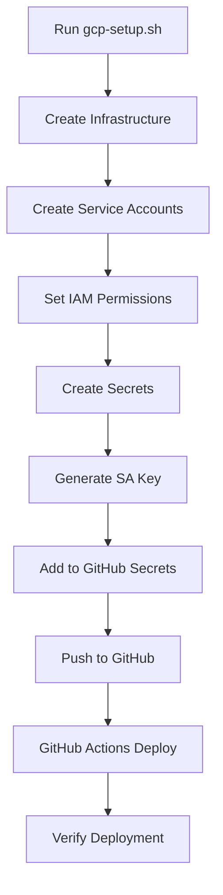

# Kronos EAM Deployment Scripts

This directory contains all the scripts needed to deploy Kronos EAM to Google Cloud Platform.

## Quick Start

For a complete fresh deployment:

```bash
# 1. Set your project ID
export GCP_PROJECT_ID="your-project-id"

# 2. Run the complete setup
./gcp-setup.sh

# 3. Copy the service account key to GitHub Secrets
cat ~/kronos-deploy-key.json
# Add as GCP_SA_KEY in GitHub Secrets

# 4. Push to GitHub to trigger deployment
git push origin main
```

## Scripts Overview

### 🚀 `gcp-setup.sh`
Complete GCP infrastructure setup including:
- Project creation and API enablement
- Service accounts with proper IAM permissions
- Cloud SQL (PostgreSQL) instance
- Redis instance
- Artifact Registry repository
- Secret Manager secrets
- Initial deployment

**Key Features:**
- Creates all 3 service accounts (deploy, backend, frontend)
- Sets up IAM permissions including `serviceAccountUser` role
- Generates service account key for GitHub Actions
- Uses correct artifact registry name (`kronos-eam`)

### 🔧 `fix-iam-permissions.sh`
Fixes IAM permission issues, specifically:
- Creates missing service accounts
- Grants `iam.serviceAccountUser` permissions
- Fixes "Permission 'iam.serviceAccounts.actAs' denied" errors
- Verifies all permissions are correctly set

Use this if you encounter deployment errors related to service accounts.

### 🔐 `fix-secrets.sh`
Fixes missing secrets in Secret Manager:
- Creates jwt-secret and redis-password
- Grants backend service account access
- Resolves "Secret was not found" errors

Use this if deployment fails with secret-related errors.

### 📊 `manage-services.sh`
Interactive service management tool:
- Start/stop local services
- View logs and status
- Run database migrations
- Execute tests

### 🔐 `create-service-account.sh`
Creates deployment service account and key:
- Creates `kronos-deploy` service account
- Grants necessary roles
- Generates JSON key for GitHub Actions

### 🗄️ `init-database.sh`
Database initialization:
- Creates database schema
- Runs Alembic migrations
- Loads initial demo data

### 📈 `monitoring-setup.sh`
Sets up monitoring and alerting:
- Cloud Monitoring dashboards
- Uptime checks
- Alert policies

### ✅ `verify-deployment.sh`
Post-deployment verification:
- Checks all services are running
- Verifies database connectivity
- Tests API endpoints
- Validates frontend access

## IAM Permissions Matrix

| Service Account | Role | Purpose |
|----------------|------|---------|
| **kronos-deploy** | `roles/run.admin` | Deploy to Cloud Run |
| | `roles/storage.admin` | Push to Artifact Registry |
| | `roles/artifactregistry.admin` | Manage artifacts |
| | `roles/cloudsql.admin` | Manage database |
| | `roles/iam.serviceAccountUser` | Act as other SAs |
| **kronos-backend** | `roles/cloudsql.client` | Connect to database |
| | `roles/secretmanager.secretAccessor` | Read secrets |
| | `roles/redis.editor` | Use Redis |
| **kronos-frontend** | - | No special permissions needed |

## Common Issues and Solutions

### 1. IAM Permission Errors
```bash
# Run the fix script
./fix-iam-permissions.sh
```

### 2. Artifact Registry Not Found
The scripts now use `kronos-eam` as the repository name, matching the GitHub Actions workflow.

### 3. Service Account Key Issues
```bash
# Regenerate key
gcloud iam service-accounts keys create ~/kronos-deploy-key-new.json \
  --iam-account=kronos-deploy@${PROJECT_ID}.iam.gserviceaccount.com
```

## Environment Variables

Set these before running scripts:
- `GCP_PROJECT_ID` - Your GCP project ID
- `GCP_REGION` - Deployment region (default: europe-west1)
- `GCP_ZONE` - Deployment zone (default: europe-west1-b)

## Security Best Practices

1. **Service Account Keys**: 
   - Rotate keys regularly
   - Never commit keys to git
   - Use GitHub Secrets for CI/CD

2. **IAM Permissions**:
   - Follow principle of least privilege
   - Review permissions quarterly
   - Use service accounts, not user accounts

3. **Secrets Management**:
   - Use Secret Manager for all secrets
   - Enable secret versioning
   - Audit secret access

## Deployment Workflows

### Available GitHub Actions Workflows

1. **Standard Deploy** (`deploy.yml`)
   - Full deployment with tests
   - Triggered on push to main
   - Option to skip tests via workflow_dispatch

2. **Quick Deploy** (`deploy-quick.yml`)
   - Skips all tests for faster deployment
   - Manual trigger only
   - ~10 minutes faster

3. **Parallel Deploy** (`deploy-parallel.yml`)
   - Builds backend and frontend in parallel
   - Uses --no-traffic for faster initial deployment
   - Routes traffic after both are deployed
   - Fastest option (~15 minutes faster)

## Deployment Flow



## Support

For issues or questions:
1. Check the troubleshooting section
2. Review logs: `gcloud logging read`
3. Open an issue on GitHub