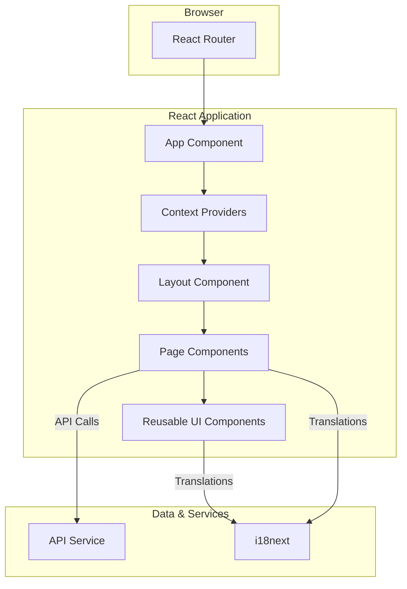
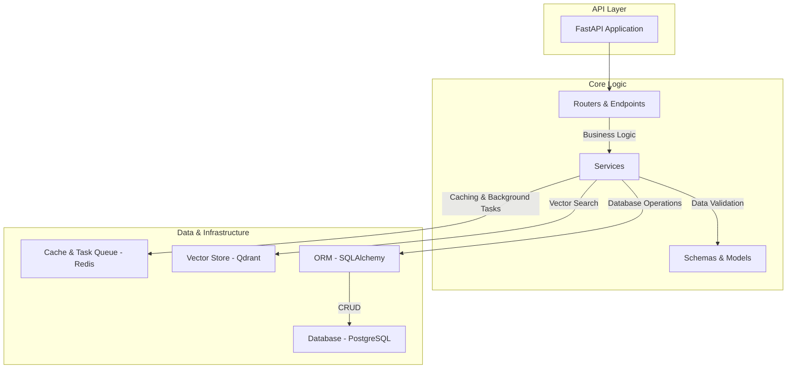

# 3. Architecture

This document provides a detailed overview of the technical architecture of the Kronos EAM solution, covering both the frontend and backend components.

## 3.1. Frontend

The frontend is a modern single-page application (SPA) built with React and TypeScript, designed for a rich, interactive user experience.

### 3.1.1. Frontend Architecture Diagram

### 3.1.2. Component Descriptions

*   **React Router**: Manages all client-side routing, ensuring a seamless navigation experience without full page reloads.
*   **App Component**: The root component of the application, responsible for setting up the main router and context providers.
*   **Context Providers**: A set of React context providers (`ThemeProvider`, `AuthProvider`, `NotificationProvider`) that manage global state and make it available to all components in the application.
*   **Layout Component**: Provides the main application layout, including the sidebar, header, and content area.
*   **Page Components**: Each page in the application (e.g., `Dashboard`, `Plants`, `Workflows`) is a dedicated component responsible for fetching and displaying its own data.
*   **Reusable UI Components**: A library of reusable UI components (e.g., buttons, forms, modals) that ensure a consistent look and feel throughout the application.
*   **API Service**: A dedicated service that handles all communication with the backend API, abstracting away the details of making HTTP requests.
*   **i18next**: The internationalization library used for managing translations and providing multi-language support.

## 3.2. Backend

The backend is a high-performance API built with FastAPI, designed for scalability, robustness, and easy maintenance.

### 3.2.1. Backend Architecture Diagram

### 3.2.2. Component Descriptions

*   **FastAPI Application**: The main entry point for the backend application, responsible for initializing the API and all its dependencies.
*   **Routers & Endpoints**: The API is organized into a series of routers, each of which defines a set of related endpoints (e.g., `/plants`, `/workflows`).
*   **Services**: A layer of services that contain the core business logic of the application, separating it from the API layer.
*   **Schemas & Models**: Pydantic schemas are used for data validation and serialization, while SQLAlchemy models define the structure of the database tables.
*   **Database**: A PostgreSQL database is used for persistent data storage.
*   **Cache & Task Queue**: Redis is used for both caching frequently accessed data and as a message broker for the Celery task queue.
*   **Vector Store**: Qdrant is used for storing and searching vector embeddings, which are used by the AI-powered features of the application.
*   **ORM**: SQLAlchemy is used as the Object-Relational Mapper (ORM) for interacting with the PostgreSQL database in an object-oriented way.
