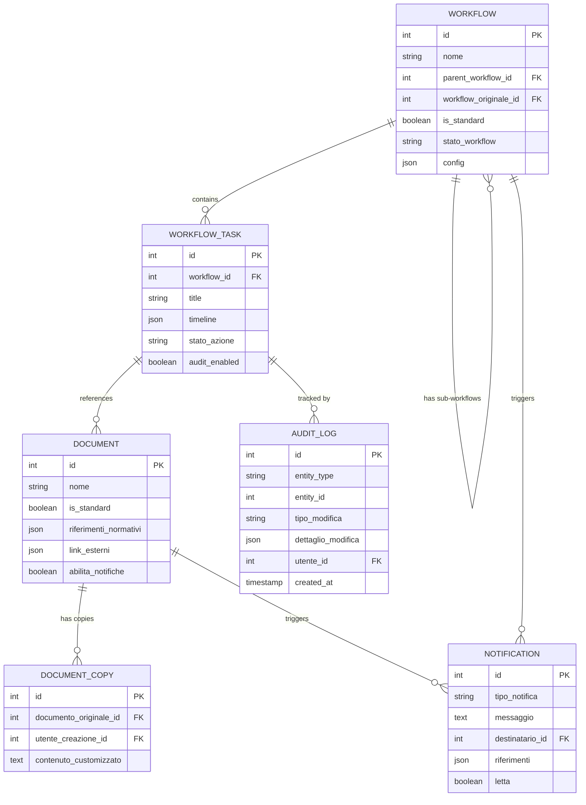

# Kronos EAM - Workflow & Document Management Integration

## Executive Summary

This document provides a comprehensive integration plan for enhancing the Kronos EAM platform with advanced workflow management, document handling, and action tracking capabilities. It combines the existing implementation with new requirements to create a unified, enterprise-grade renewable energy asset management system.

## Table of Contents

1. [Current System Architecture](#current-system-architecture)
2. [New Requirements Overview](#new-requirements-overview)
3. [Integration Architecture](#integration-architecture)
4. [Implementation Plan](#implementation-plan)
5. [Data Model Integration](#data-model-integration)
6. [API Design](#api-design)
7. [Security & Compliance](#security-compliance)
8. [Migration Strategy](#migration-strategy)
9. [Testing Strategy](#testing-strategy)
10. [Deployment Plan](#deployment-plan)

## Current System Architecture

### Existing Core Components

#### 1. Workflow Management System

**Current Models:**
- `Workflow`: Main workflow entity with multi-phase support
- `WorkflowStage`: Sequential phases within workflows
- `WorkflowTask`: Individual tasks with entity integration
- `WorkflowTemplate`: Predefined templates (complete and phase-based)

**Key Features:**
- Multi-phase workflow architecture (Progettazione, Connessione, Registrazione, Fiscale)
- Phase-based template composition
- Entity-specific integration (DSO, Terna, GSE, Dogane)
- Task dependencies and automation configuration
- Smart template selection based on plant characteristics

#### 2. Document Management System

**Current Models:**
- `Document`: Core document entity with versioning
- `DocumentVersion`: Version history tracking
- `DocumentExtraction`: AI-powered content extraction
- `DocumentTemplate`: Template-based document generation
- `TaskDocument`: Task-document associations

**Key Features:**
- Multi-format support (PDF, DOC, XLS, P7M)
- Version control with SHA256 checksums
- AI extraction pipeline integration
- Encryption and digital signature support
- Task and workflow associations

#### 3. User & Access Management

**Current Models:**
- `User`: Multi-tenant user management
- `ApiKey`: Programmatic access control
- `UserSession`: Session tracking and management

**Role Hierarchy:**
- Admin: Full system access
- Asset Manager: Plant and workflow management
- Operativo: Operational tasks execution
- Viewer: Read-only access

#### 4. Notification System (Partial)

**Current State:**
- Basic `Notification` model exists
- WebSocket infrastructure in place
- Email configuration present
- Service implementation incomplete

## New Requirements Overview

### Document Management Enhancements (FR-DOC-001 to FR-DOC-006)

1. **Standard Document Management**
   - Admin-managed document templates
   - Normative references and external links
   - Version control with update notifications

2. **Document Customization**
   - Copy standard documents for customization
   - Maintain reference to original
   - Track customization history

3. **Advanced Search**
   - Full-text search capability
   - Normative reference filtering
   - Multi-criteria search

### Action Management System (FR-AZN-001 to FR-AZN-005)

1. **Enhanced Task Model**
   - Detailed timeline management
   - Responsible party assignment
   - Document associations

2. **Comprehensive Audit Trail**
   - All modifications tracked
   - User attribution
   - Timestamp precision

3. **Status Management**
   - Defined state transitions
   - Automatic status updates
   - Deadline monitoring

### Workflow Enhancements (FR-WFL-001 to FR-WFL-008)

1. **Workflow Customization**
   - Copy and modify standard workflows
   - Maintain template references
   - Version tracking

2. **Sub-Workflow Support**
   - Hierarchical workflow structures
   - Modular workflow composition
   - Dependency management

3. **Standard Workflow Types**
   - Registrazione Impianto Standard
   - Registrazione Impianto Semplificato
   - Inserimento Membro in Comunità Energetica

## Integration Architecture

### Enhanced Data Model



### System Architecture Diagram

```
┌─────────────────────────────────────────────────────────────────┐
│                        Frontend (React)                          │
├─────────────────────────────────────────────────────────────────┤
│                    API Gateway (FastAPI)                         │
├─────────────────┬───────────────┬───────────────┬──────────────┤
│  Workflow       │   Document    │    Action     │ Notification │
│  Service        │   Service     │   Service     │   Service    │
├─────────────────┴───────────────┴───────────────┴──────────────┤
│                    Business Logic Layer                          │
├─────────────────┬───────────────┬───────────────┬──────────────┤
│  Audit          │  Integration  │   AI/ML       │   Storage    │
│  Service        │   Manager     │   Engine      │   Service    │
├─────────────────┴───────────────┴───────────────┴──────────────┤
│                    Data Access Layer                             │
├─────────────────────────────────────────────────────────────────┤
│              PostgreSQL          │        Redis Cache            │
└─────────────────────────────────────────────────────────────────┘
```

## Implementation Plan

### Phase 1: Foundation Enhancement (Week 1-2)

#### 1.1 Database Schema Updates

```sql
-- Enhanced workflow support
ALTER TABLE workflows 
ADD COLUMN parent_workflow_id INTEGER REFERENCES workflows(id),
ADD COLUMN workflow_originale_id INTEGER REFERENCES workflows(id),
ADD COLUMN is_standard BOOLEAN DEFAULT FALSE,
ADD COLUMN tipo_workflow VARCHAR(50);

-- Enhanced task/action support
ALTER TABLE workflow_tasks
ADD COLUMN timeline JSON,
ADD COLUMN audit_enabled BOOLEAN DEFAULT TRUE,
ADD COLUMN documenti_associati JSON;

-- Enhanced document support
ALTER TABLE documents
ADD COLUMN is_standard BOOLEAN DEFAULT FALSE,
ADD COLUMN riferimenti_normativi JSON,
ADD COLUMN link_esterni JSON,
ADD COLUMN abilita_notifiche BOOLEAN DEFAULT TRUE;

-- New tables
CREATE TABLE document_copies (
    id SERIAL PRIMARY KEY,
    documento_originale_id INTEGER REFERENCES documents(id),
    utente_creazione_id INTEGER REFERENCES users(id),
    contenuto_customizzato TEXT,
    data_copia TIMESTAMP DEFAULT CURRENT_TIMESTAMP,
    ultima_modifica_copia TIMESTAMP DEFAULT CURRENT_TIMESTAMP,
    nome_copia VARCHAR(255),
    tenant_id INTEGER NOT NULL,
    created_at TIMESTAMP DEFAULT CURRENT_TIMESTAMP,
    updated_at TIMESTAMP DEFAULT CURRENT_TIMESTAMP
);

CREATE TABLE audit_logs (
    id SERIAL PRIMARY KEY,
    entity_type VARCHAR(50) NOT NULL,
    entity_id INTEGER NOT NULL,
    tipo_modifica VARCHAR(50) NOT NULL,
    dettaglio_modifica JSON,
    utente_id INTEGER REFERENCES users(id),
    tenant_id INTEGER NOT NULL,
    created_at TIMESTAMP DEFAULT CURRENT_TIMESTAMP
);

CREATE INDEX idx_audit_logs_entity ON audit_logs(entity_type, entity_id);
CREATE INDEX idx_audit_logs_user ON audit_logs(utente_id);
CREATE INDEX idx_audit_logs_created ON audit_logs(created_at);
```

#### 1.2 Model Updates

**Enhanced WorkflowTask Model:**
```python
class WorkflowTask(BaseModel):
    # Existing fields...
    
    # New fields for action management
    timeline = Column(JSON, default=dict)  # {inizio, fine, scadenza}
    documenti_associati = Column(JSON, default=list)
    audit_enabled = Column(Boolean, default=True)
    stato_azione = Column(Enum(AzioneStatusEnum))
    
    @property
    def is_overdue(self):
        if self.timeline and self.timeline.get('scadenza'):
            return datetime.utcnow() > self.timeline['scadenza']
        return False
```

**New DocumentCopy Model:**
```python
class DocumentCopy(BaseModel):
    __tablename__ = "document_copies"
    
    documento_originale_id = Column(Integer, ForeignKey("documents.id"))
    utente_creazione_id = Column(Integer, ForeignKey("users.id"))
    contenuto_customizzato = Column(Text)
    data_copia = Column(DateTime, default=datetime.utcnow)
    ultima_modifica_copia = Column(DateTime, default=datetime.utcnow)
    nome_copia = Column(String(255))
    
    # Relationships
    documento_originale = relationship("Document")
    utente_creazione = relationship("User")
```

**Universal Audit Log Model:**
```python
class AuditLog(BaseModel):
    __tablename__ = "audit_logs"
    
    entity_type = Column(String(50), nullable=False)
    entity_id = Column(Integer, nullable=False)
    tipo_modifica = Column(Enum(TipoModificaEnum), nullable=False)
    dettaglio_modifica = Column(JSON)
    utente_id = Column(Integer, ForeignKey("users.id"))
    
    # Relationships
    utente = relationship("User")
    
    @classmethod
    def log_change(cls, db, entity, tipo_modifica, user_id, details=None):
        """Helper method to create audit log entries"""
        log = cls(
            entity_type=entity.__class__.__name__,
            entity_id=entity.id,
            tipo_modifica=tipo_modifica,
            dettaglio_modifica=details or {},
            utente_id=user_id,
            tenant_id=entity.tenant_id
        )
        db.add(log)
        return log
```

### Phase 2: Service Layer Implementation (Week 3-4)

#### 2.1 Enhanced Document Service

```python
class DocumentService:
    def __init__(self, db: Session):
        self.db = db
    
    def create_standard_document(self, doc_data: DocumentCreate, user_id: int) -> Document:
        """Create a standard document (admin only)"""
        doc = Document(
            **doc_data.dict(),
            is_standard=True,
            created_by=user_id
        )
        self.db.add(doc)
        
        # Create audit log
        AuditLog.log_change(self.db, doc, TipoModificaEnum.CREAZIONE, user_id)
        
        self.db.commit()
        return doc
    
    def copy_document(self, doc_id: int, user_id: int, customizations: dict) -> DocumentCopy:
        """Create a customized copy of a standard document"""
        original = self.db.query(Document).filter(Document.id == doc_id).first()
        if not original or not original.is_standard:
            raise ValueError("Document not found or not a standard document")
        
        copy = DocumentCopy(
            documento_originale_id=doc_id,
            utente_creazione_id=user_id,
            contenuto_customizzato=customizations.get('content'),
            nome_copia=customizations.get('name', f"Copia di {original.nome}")
        )
        self.db.add(copy)
        
        # Log the copy action
        AuditLog.log_change(
            self.db, copy, TipoModificaEnum.CREAZIONE, user_id,
            {"original_document_id": doc_id}
        )
        
        self.db.commit()
        return copy
    
    def search_documents(self, query: DocumentSearchQuery) -> List[Document]:
        """Advanced document search with multiple criteria"""
        q = self.db.query(Document)
        
        if query.keywords:
            # Full-text search on name and description
            q = q.filter(
                or_(
                    Document.nome.ilike(f"%{query.keywords}%"),
                    Document.descrizione.ilike(f"%{query.keywords}%")
                )
            )
        
        if query.riferimenti_normativi:
            # Search in normative references JSON
            q = q.filter(
                Document.riferimenti_normativi.contains(query.riferimenti_normativi)
            )
        
        if query.categoria:
            q = q.filter(Document.categoria == query.categoria)
        
        if query.stato:
            q = q.filter(Document.stato == query.stato)
        
        return q.all()
```

#### 2.2 Action Management Service

```python
class ActionService:
    def __init__(self, db: Session, notification_service: NotificationService):
        self.db = db
        self.notification_service = notification_service
    
    def create_action(self, action_data: ActionCreate, user_id: int) -> WorkflowTask:
        """Create a new action with full tracking"""
        action = WorkflowTask(
            **action_data.dict(),
            stato_azione=AzioneStatusEnum.IN_ATTESA,
            created_by=user_id
        )
        self.db.add(action)
        
        # Create audit log
        AuditLog.log_change(
            self.db, action, TipoModificaEnum.CREAZIONE, user_id,
            {"initial_data": action_data.dict()}
        )
        
        # Send notification to assignee
        if action.assignee:
            self.notification_service.notify_task_assignment(action)
        
        self.db.commit()
        return action
    
    def update_action_status(self, action_id: int, new_status: str, user_id: int):
        """Update action status with audit trail"""
        action = self.db.query(WorkflowTask).get(action_id)
        old_status = action.stato_azione
        
        action.stato_azione = new_status
        
        # Log the status change
        AuditLog.log_change(
            self.db, action, TipoModificaEnum.STATO_CAMBIO, user_id,
            {"old_status": old_status, "new_status": new_status}
        )
        
        # Check for completion
        if new_status == AzioneStatusEnum.COMPLETATO:
            action.completato_da = user_id
            action.completato_data = datetime.utcnow()
            
            # Notify workflow owner
            self.notification_service.notify_task_completion(action)
        
        self.db.commit()
    
    def get_action_audit_trail(self, action_id: int) -> List[AuditLog]:
        """Get complete audit trail for an action"""
        return self.db.query(AuditLog).filter(
            AuditLog.entity_type == "WorkflowTask",
            AuditLog.entity_id == action_id
        ).order_by(AuditLog.created_at.desc()).all()
```

#### 2.3 Enhanced Workflow Service

```python
class WorkflowService:
    def __init__(self, db: Session, action_service: ActionService):
        self.db = db
        self.action_service = action_service
    
    def copy_workflow(self, workflow_id: int, user_id: int, customizations: dict) -> Workflow:
        """Create a customized copy of a standard workflow"""
        original = self.db.query(Workflow).get(workflow_id)
        if not original:
            raise ValueError("Workflow not found")
        
        # Create workflow copy
        workflow_copy = Workflow(
            nome=customizations.get('nome', f"Copia di {original.nome}"),
            descrizione=customizations.get('descrizione', original.descrizione),
            workflow_originale_id=workflow_id,
            is_standard=False,
            impianto_id=customizations.get('impianto_id'),
            categoria=original.categoria,
            tipo_workflow=original.tipo_workflow,
            created_by=user_id
        )
        self.db.add(workflow_copy)
        self.db.flush()
        
        # Copy stages and tasks
        for stage in original.stages:
            stage_copy = WorkflowStage(
                workflow_id=workflow_copy.id,
                nome=stage.nome,
                ordine=stage.ordine
            )
            self.db.add(stage_copy)
            self.db.flush()
            
            for task in stage.tasks:
                task_copy = WorkflowTask(
                    workflow_id=workflow_copy.id,
                    stage_id=stage_copy.id,
                    title=task.title,
                    descrizione=task.descrizione,
                    priority=task.priority,
                    timeline=task.timeline,
                    documenti_associati=task.documenti_associati
                )
                self.db.add(task_copy)
        
        # Log the copy action
        AuditLog.log_change(
            self.db, workflow_copy, TipoModificaEnum.CREAZIONE, user_id,
            {"copied_from": workflow_id}
        )
        
        self.db.commit()
        return workflow_copy
    
    def create_sub_workflow(self, parent_id: int, sub_workflow_data: dict, user_id: int):
        """Create a sub-workflow within a parent workflow"""
        parent = self.db.query(Workflow).get(parent_id)
        if not parent:
            raise ValueError("Parent workflow not found")
        
        sub_workflow = Workflow(
            **sub_workflow_data,
            parent_workflow_id=parent_id,
            created_by=user_id
        )
        self.db.add(sub_workflow)
        
        # Update parent workflow state if needed
        self._update_parent_state(parent)
        
        self.db.commit()
        return sub_workflow
    
    def execute_workflow(self, workflow_id: int, user_id: int):
        """Execute a workflow with state management"""
        workflow = self.db.query(Workflow).get(workflow_id)
        
        # Update workflow state
        workflow.stato_corrente = WorkflowStatusEnum.ACTIVE
        workflow.data_inizio = datetime.utcnow()
        
        # Activate first stage tasks
        first_stage = self.db.query(WorkflowStage).filter(
            WorkflowStage.workflow_id == workflow_id,
            WorkflowStage.ordine == 1
        ).first()
        
        if first_stage:
            for task in first_stage.tasks:
                task.status = TaskStatusEnum.DA_INIZIARE
                
                # Send notifications for task assignments
                if task.assignee:
                    notification_service.notify_task_assignment(task)
        
        # Log workflow start
        AuditLog.log_change(
            self.db, workflow, TipoModificaEnum.STATO_CAMBIO, user_id,
            {"new_state": "ACTIVE", "started_at": datetime.utcnow().isoformat()}
        )
        
        self.db.commit()
```

### Phase 3: Notification System Completion (Week 5-6)

#### 3.1 Complete Notification Service

```python
class NotificationService:
    def __init__(self, db: Session, email_service: EmailService):
        self.db = db
        self.email_service = email_service
    
    def create_notification(
        self,
        tipo: TipoNotificaEnum,
        destinatario_id: int,
        messaggio: str,
        riferimenti: dict = None
    ) -> Notification:
        """Create a new notification"""
        notification = Notification(
            tipo_notifica=tipo,
            messaggio=messaggio,
            destinatario_id=destinatario_id,
            riferimenti=riferimenti or {},
            letta=False
        )
        self.db.add(notification)
        self.db.commit()
        
        # Send real-time notification via WebSocket
        self._send_realtime_notification(notification)
        
        # Check user preferences for email
        user = self.db.query(User).get(destinatario_id)
        if user.get_preference('email_notifications', True):
            self._queue_email_notification(notification, user)
        
        return notification
    
    def notify_document_update(self, document: Document, updated_by: int):
        """Notify users when a standard document is updated"""
        # Find all users with copies of this document
        copies = self.db.query(DocumentCopy).filter(
            DocumentCopy.documento_originale_id == document.id
        ).all()
        
        for copy in copies:
            self.create_notification(
                tipo=TipoNotificaEnum.AGGIORNAMENTO_DOCUMENTO,
                destinatario_id=copy.utente_creazione_id,
                messaggio=f"Il documento standard '{document.nome}' è stato aggiornato",
                riferimenti={
                    "document_id": document.id,
                    "copy_id": copy.id,
                    "updated_by": updated_by
                }
            )
    
    def notify_task_assignment(self, task: WorkflowTask):
        """Notify user of task assignment"""
        if not task.assignee:
            return
        
        user = self.db.query(User).filter(User.email == task.assignee).first()
        if user:
            self.create_notification(
                tipo=TipoNotificaEnum.AZIONE_ASSEGNATA,
                destinatario_id=user.id,
                messaggio=f"Ti è stato assegnato il task: {task.title}",
                riferimenti={
                    "task_id": task.id,
                    "workflow_id": task.workflow_id,
                    "due_date": task.timeline.get('scadenza') if task.timeline else None
                }
            )
    
    def notify_deadline_approaching(self, task: WorkflowTask, days_until_deadline: int):
        """Notify of approaching deadline"""
        if task.assignee:
            user = self.db.query(User).filter(User.email == task.assignee).first()
            if user:
                self.create_notification(
                    tipo=TipoNotificaEnum.SCADENZA_IMMINENTE,
                    destinatario_id=user.id,
                    messaggio=f"Il task '{task.title}' scade tra {days_until_deadline} giorni",
                    riferimenti={
                        "task_id": task.id,
                        "workflow_id": task.workflow_id,
                        "deadline": task.timeline.get('scadenza')
                    }
                )
    
    def _send_realtime_notification(self, notification: Notification):
        """Send notification via WebSocket"""
        from app.services.websocket_manager import manager
        
        # Convert notification to dict for JSON serialization
        notification_data = {
            "id": notification.id,
            "tipo": notification.tipo_notifica,
            "messaggio": notification.messaggio,
            "timestamp": notification.created_at.isoformat(),
            "letta": notification.letta
        }
        
        # Send to specific user's WebSocket connection
        manager.send_to_user(
            user_id=notification.destinatario_id,
            message={"type": "notification", "data": notification_data}
        )
    
    def _queue_email_notification(self, notification: Notification, user: User):
        """Queue email notification for async sending"""
        from app.tasks.notification_tasks import send_email_notification
        
        # Queue the task for Celery
        send_email_notification.delay(
            notification_id=notification.id,
            user_email=user.email
        )
```

#### 3.2 Background Tasks for Notifications

```python
# app/tasks/notification_tasks.py
from celery import Celery
from datetime import datetime, timedelta

celery_app = Celery('kronos_eam')

@celery_app.task
def send_email_notification(notification_id: int, user_email: str):
    """Send email notification"""
    from app.services.email_service import EmailService
    from app.models import Notification
    
    db = get_db()
    notification = db.query(Notification).get(notification_id)
    
    if notification:
        email_service = EmailService()
        email_service.send_notification_email(
            to_email=user_email,
            subject=f"Kronos EAM - {notification.tipo_notifica}",
            notification=notification
        )

@celery_app.task
def check_approaching_deadlines():
    """Daily task to check for approaching deadlines"""
    from app.services.notification_service import NotificationService
    
    db = get_db()
    notification_service = NotificationService(db)
    
    # Check tasks with deadlines in next 7 days
    upcoming_tasks = db.query(WorkflowTask).filter(
        WorkflowTask.timeline['scadenza'].astext.cast(DateTime) <= datetime.utcnow() + timedelta(days=7),
        WorkflowTask.timeline['scadenza'].astext.cast(DateTime) > datetime.utcnow(),
        WorkflowTask.status != TaskStatusEnum.COMPLETATO
    ).all()
    
    for task in upcoming_tasks:
        days_until = (task.timeline['scadenza'] - datetime.utcnow()).days
        notification_service.notify_deadline_approaching(task, days_until)

@celery_app.task
def generate_notification_digest():
    """Generate daily digest of notifications"""
    from app.services.notification_service import NotificationService
    
    db = get_db()
    
    # Get users who want digest emails
    users = db.query(User).filter(
        User.preferenze['notification_digest'].astext == 'true'
    ).all()
    
    for user in users:
        # Get unread notifications from last 24 hours
        notifications = db.query(Notification).filter(
            Notification.destinatario_id == user.id,
            Notification.letta == False,
            Notification.created_at >= datetime.utcnow() - timedelta(days=1)
        ).all()
        
        if notifications:
            email_service.send_digest_email(user, notifications)
```

### Phase 4: API Implementation (Week 7-8)

#### 4.1 Document API Enhancements

```python
# app/api/v1/endpoints/documents.py

@router.post("/standard", response_model=DocumentResponse)
def create_standard_document(
    *,
    db: Session = Depends(deps.get_db),
    current_user: User = Depends(deps.get_current_admin_user),
    document_in: DocumentCreateStandard
):
    """Create a standard document (admin only)"""
    service = DocumentService(db)
    document = service.create_standard_document(document_in, current_user.id)
    return document

@router.post("/{document_id}/copy", response_model=DocumentCopyResponse)
def copy_document(
    *,
    db: Session = Depends(deps.get_db),
    current_user: User = Depends(deps.get_current_active_user),
    document_id: int,
    customizations: DocumentCustomization
):
    """Create a customized copy of a standard document"""
    service = DocumentService(db)
    copy = service.copy_document(document_id, current_user.id, customizations.dict())
    return copy

@router.get("/search", response_model=List[DocumentResponse])
def search_documents(
    *,
    db: Session = Depends(deps.get_db),
    current_user: User = Depends(deps.get_current_active_user),
    keywords: Optional[str] = None,
    riferimenti_normativi: Optional[str] = None,
    categoria: Optional[DocumentCategoryEnum] = None,
    stato: Optional[DocumentStatusEnum] = None,
    skip: int = 0,
    limit: int = 100
):
    """Advanced document search"""
    service = DocumentService(db)
    query = DocumentSearchQuery(
        keywords=keywords,
        riferimenti_normativi=riferimenti_normativi,
        categoria=categoria,
        stato=stato
    )
    documents = service.search_documents(query)
    return documents[skip:skip + limit]
```

#### 4.2 Action Management API

```python
# app/api/v1/endpoints/actions.py

@router.post("/", response_model=ActionResponse)
def create_action(
    *,
    db: Session = Depends(deps.get_db),
    current_user: User = Depends(deps.get_current_active_user),
    action_in: ActionCreate
):
    """Create a new action"""
    service = ActionService(db, notification_service)
    action = service.create_action(action_in, current_user.id)
    return action

@router.put("/{action_id}/status", response_model=ActionResponse)
def update_action_status(
    *,
    db: Session = Depends(deps.get_db),
    current_user: User = Depends(deps.get_current_active_user),
    action_id: int,
    status_update: ActionStatusUpdate
):
    """Update action status with audit logging"""
    service = ActionService(db, notification_service)
    service.update_action_status(action_id, status_update.new_status, current_user.id)
    
    # Return updated action
    action = db.query(WorkflowTask).get(action_id)
    return action

@router.get("/{action_id}/audit-trail", response_model=List[AuditLogResponse])
def get_action_audit_trail(
    *,
    db: Session = Depends(deps.get_db),
    current_user: User = Depends(deps.get_current_active_user),
    action_id: int
):
    """Get complete audit trail for an action"""
    service = ActionService(db, notification_service)
    audit_logs = service.get_action_audit_trail(action_id)
    return audit_logs

@router.post("/bulk-assign", response_model=List[ActionResponse])
def bulk_assign_actions(
    *,
    db: Session = Depends(deps.get_db),
    current_user: User = Depends(deps.get_current_active_user),
    assignment: BulkActionAssignment
):
    """Bulk assign multiple actions to users"""
    service = ActionService(db, notification_service)
    updated_actions = []
    
    for action_id in assignment.action_ids:
        action = db.query(WorkflowTask).get(action_id)
        if action:
            old_assignee = action.assignee
            action.assignee = assignment.assignee
            
            # Log the assignment
            AuditLog.log_change(
                db, action, TipoModificaEnum.RESPONSABILE_CAMBIO, current_user.id,
                {"old_assignee": old_assignee, "new_assignee": assignment.assignee}
            )
            
            updated_actions.append(action)
    
    db.commit()
    
    # Send notifications
    for action in updated_actions:
        notification_service.notify_task_assignment(action)
    
    return updated_actions
```

#### 4.3 Enhanced Workflow API

```python
# app/api/v1/endpoints/workflows.py

@router.post("/{workflow_id}/copy", response_model=WorkflowResponse)
def copy_workflow(
    *,
    db: Session = Depends(deps.get_db),
    current_user: User = Depends(deps.get_current_active_user),
    workflow_id: int,
    customizations: WorkflowCustomization
):
    """Create a customized copy of a workflow"""
    service = WorkflowService(db, action_service)
    workflow_copy = service.copy_workflow(workflow_id, current_user.id, customizations.dict())
    return workflow_copy

@router.post("/{workflow_id}/sub-workflows", response_model=WorkflowResponse)
def create_sub_workflow(
    *,
    db: Session = Depends(deps.get_db),
    current_user: User = Depends(deps.get_current_active_user),
    workflow_id: int,
    sub_workflow_in: SubWorkflowCreate
):
    """Create a sub-workflow within a parent workflow"""
    service = WorkflowService(db, action_service)
    sub_workflow = service.create_sub_workflow(
        workflow_id, 
        sub_workflow_in.dict(), 
        current_user.id
    )
    return sub_workflow

@router.post("/{workflow_id}/execute", response_model=WorkflowResponse)
def execute_workflow(
    *,
    db: Session = Depends(deps.get_db),
    current_user: User = Depends(deps.get_current_active_user),
    workflow_id: int
):
    """Start workflow execution"""
    service = WorkflowService(db, action_service)
    service.execute_workflow(workflow_id, current_user.id)
    
    workflow = db.query(Workflow).get(workflow_id)
    return workflow

@router.get("/standard-types", response_model=List[WorkflowTypeInfo])
def get_standard_workflow_types(
    *,
    db: Session = Depends(deps.get_db),
    current_user: User = Depends(deps.get_current_active_user)
):
    """Get available standard workflow types"""
    return [
        WorkflowTypeInfo(
            code="REGISTRAZIONE_STANDARD",
            nome="Registrazione Impianto Standard",
            descrizione="Processo completo per registrazione nuovo impianto",
            durata_stimata_giorni=180,
            fasi=["Progettazione", "Connessione", "Registrazione", "Fiscale"]
        ),
        WorkflowTypeInfo(
            code="REGISTRAZIONE_SEMPLIFICATA",
            nome="Registrazione Impianto Semplificato",
            descrizione="Processo semplificato per piccoli impianti",
            durata_stimata_giorni=90,
            fasi=["Progettazione", "Connessione Semplificata", "Registrazione"]
        ),
        WorkflowTypeInfo(
            code="COMUNITA_ENERGETICA",
            nome="Inserimento Membro in Comunità Energetica",
            descrizione="Processo per aggiungere nuovo membro a comunità energetica",
            durata_stimata_giorni=30,
            fasi=["Verifica Requisiti", "Contrattualistica", "Attivazione"]
        )
    ]
```

### Phase 5: Frontend Integration (Week 9-10)

#### 5.1 Enhanced Document Management UI

```typescript
// components/documents/DocumentManager.tsx
import React, { useState, useEffect } from 'react';
import { 
  DocumentList, 
  DocumentUpload, 
  DocumentSearch,
  DocumentCopyDialog 
} from './components';
import { documentService } from '../../services/api';

export const DocumentManager: React.FC = () => {
  const [documents, setDocuments] = useState<Document[]>([]);
  const [selectedDocument, setSelectedDocument] = useState<Document | null>(null);
  const [showCopyDialog, setShowCopyDialog] = useState(false);
  
  const handleSearch = async (criteria: SearchCriteria) => {
    const results = await documentService.searchDocuments(criteria);
    setDocuments(results);
  };
  
  const handleCopyDocument = async (customizations: any) => {
    if (selectedDocument) {
      const copy = await documentService.copyDocument(
        selectedDocument.id, 
        customizations
      );
      // Refresh document list
      await loadDocuments();
      setShowCopyDialog(false);
    }
  };
  
  return (
    <div className="document-manager">
      <DocumentSearch onSearch={handleSearch} />
      <DocumentList 
        documents={documents}
        onDocumentSelect={setSelectedDocument}
        onCopyRequest={(doc) => {
          setSelectedDocument(doc);
          setShowCopyDialog(true);
        }}
      />
      {showCopyDialog && (
        <DocumentCopyDialog
          document={selectedDocument}
          onCopy={handleCopyDocument}
          onClose={() => setShowCopyDialog(false)}
        />
      )}
    </div>
  );
};
```

#### 5.2 Action Management Dashboard

```typescript
// components/actions/ActionDashboard.tsx
import React, { useState, useEffect } from 'react';
import { 
  ActionList, 
  ActionTimeline, 
  ActionAuditTrail,
  ActionBulkAssign 
} from './components';
import { actionService, notificationService } from '../../services/api';

export const ActionDashboard: React.FC = () => {
  const [actions, setActions] = useState<Action[]>([]);
  const [selectedAction, setSelectedAction] = useState<Action | null>(null);
  const [auditTrail, setAuditTrail] = useState<AuditLog[]>([]);
  
  useEffect(() => {
    // Subscribe to real-time action updates
    const subscription = notificationService.subscribeToActionUpdates(
      (update) => {
        // Update action in list
        setActions(prev => 
          prev.map(a => a.id === update.actionId ? update.action : a)
        );
      }
    );
    
    return () => subscription.unsubscribe();
  }, []);
  
  const handleActionSelect = async (action: Action) => {
    setSelectedAction(action);
    // Load audit trail
    const trail = await actionService.getAuditTrail(action.id);
    setAuditTrail(trail);
  };
  
  const handleStatusUpdate = async (actionId: number, newStatus: string) => {
    await actionService.updateStatus(actionId, newStatus);
    // Refresh action list
    await loadActions();
  };
  
  return (
    <div className="action-dashboard grid grid-cols-3 gap-4">
      <div className="col-span-2">
        <ActionList 
          actions={actions}
          onSelect={handleActionSelect}
          onStatusUpdate={handleStatusUpdate}
        />
      </div>
      <div>
        {selectedAction && (
          <>
            <ActionTimeline action={selectedAction} />
            <ActionAuditTrail logs={auditTrail} />
          </>
        )}
      </div>
    </div>
  );
};
```

#### 5.3 Enhanced Workflow Wizard

```typescript
// components/workflows/EnhancedWorkflowWizard.tsx
import React, { useState } from 'react';
import { 
  WorkflowTypeSelector,
  WorkflowCustomizer,
  SubWorkflowBuilder,
  WorkflowReview 
} from './components';

export const EnhancedWorkflowWizard: React.FC = () => {
  const [workflowType, setWorkflowType] = useState<WorkflowType | null>(null);
  const [customizations, setCustomizations] = useState<any>({});
  const [subWorkflows, setSubWorkflows] = useState<SubWorkflow[]>([]);
  
  const steps = [
    {
      title: 'Seleziona Tipo',
      component: (
        <WorkflowTypeSelector
          onSelect={setWorkflowType}
          selected={workflowType}
        />
      )
    },
    {
      title: 'Personalizza',
      component: (
        <WorkflowCustomizer
          workflowType={workflowType}
          customizations={customizations}
          onChange={setCustomizations}
        />
      )
    },
    {
      title: 'Sotto-Workflow',
      component: (
        <SubWorkflowBuilder
          parentType={workflowType}
          subWorkflows={subWorkflows}
          onChange={setSubWorkflows}
        />
      )
    },
    {
      title: 'Revisione',
      component: (
        <WorkflowReview
          workflowType={workflowType}
          customizations={customizations}
          subWorkflows={subWorkflows}
          onConfirm={handleCreateWorkflow}
        />
      )
    }
  ];
  
  const handleCreateWorkflow = async () => {
    const result = await workflowService.createWorkflow({
      type: workflowType,
      customizations,
      subWorkflows
    });
    
    // Navigate to workflow detail
    navigate(`/workflows/${result.id}`);
  };
  
  return <WizardStepper steps={steps} />;
};
```

## Security & Compliance

### Data Protection

1. **Encryption**
   - All documents encrypted at rest using AES-256
   - TLS 1.3 for data in transit
   - Field-level encryption for sensitive data

2. **Access Control**
   - Row-level security for multi-tenancy
   - Attribute-based access control (ABAC)
   - API rate limiting per tenant

3. **Audit & Compliance**
   - Complete audit trail for all operations
   - GDPR compliance with data retention policies
   - Regular security audits

### Authentication & Authorization

```python
# Enhanced permission system
class PermissionChecker:
    @staticmethod
    def can_create_standard_document(user: User) -> bool:
        return user.ruolo == UserRoleEnum.ADMIN
    
    @staticmethod
    def can_copy_document(user: User, document: Document) -> bool:
        if document.is_standard:
            return True  # Anyone can copy standard documents
        return document.tenant_id == user.tenant_id
    
    @staticmethod
    def can_modify_workflow(user: User, workflow: Workflow) -> bool:
        if workflow.is_standard:
            return user.ruolo == UserRoleEnum.ADMIN
        return (
            workflow.tenant_id == user.tenant_id and
            user.ruolo in [UserRoleEnum.ADMIN, UserRoleEnum.ASSET_MANAGER]
        )
```

## Migration Strategy

### Phase 1: Schema Migration
```bash
# Generate migration
alembic revision --autogenerate -m "Add workflow and document enhancements"

# Review and modify migration
# Add data migration for existing records

# Apply migration
alembic upgrade head
```

### Phase 2: Data Migration
```python
# Migration script for existing data
def migrate_existing_workflows():
    """Mark existing workflows and set proper flags"""
    db = get_db()
    
    # Mark all existing workflows as non-standard
    db.execute(
        "UPDATE workflows SET is_standard = FALSE WHERE is_standard IS NULL"
    )
    
    # Set workflow types based on templates
    db.execute("""
        UPDATE workflows w
        SET tipo_workflow = CASE
            WHEN t.nome LIKE '%Standard%' THEN 'REGISTRAZIONE_STANDARD'
            WHEN t.nome LIKE '%Semplificat%' THEN 'REGISTRAZIONE_SEMPLIFICATA'
            ELSE 'CUSTOM'
        END
        FROM workflow_templates t
        WHERE w.template_id = t.id
    """)
    
    db.commit()
```

### Phase 3: Feature Toggle
```python
# Feature flags for gradual rollout
FEATURE_FLAGS = {
    "enhanced_documents": {
        "enabled": True,
        "tenants": ["all"]  # or specific tenant IDs
    },
    "workflow_copying": {
        "enabled": True,
        "tenants": ["demo", "tenant_123"]
    },
    "sub_workflows": {
        "enabled": False,  # Not yet ready
        "tenants": []
    }
}
```

## Testing Strategy

### Unit Tests
```python
# tests/test_document_service.py
def test_copy_standard_document():
    """Test copying a standard document"""
    service = DocumentService(db)
    
    # Create standard document
    standard_doc = service.create_standard_document(
        DocumentCreate(nome="Template", is_standard=True),
        admin_user.id
    )
    
    # Copy document
    copy = service.copy_document(
        standard_doc.id,
        regular_user.id,
        {"name": "My Copy", "content": "Customized"}
    )
    
    assert copy.documento_originale_id == standard_doc.id
    assert copy.nome_copia == "My Copy"
    assert copy.utente_creazione_id == regular_user.id
```

### Integration Tests
```python
# tests/test_workflow_integration.py
def test_workflow_with_sub_workflows():
    """Test creating workflow with sub-workflows"""
    # Create parent workflow
    parent = workflow_service.create_workflow(...)
    
    # Add sub-workflow
    sub = workflow_service.create_sub_workflow(
        parent.id,
        {"nome": "Sub-process", "tasks": [...]},
        user.id
    )
    
    # Verify relationships
    assert sub.parent_workflow_id == parent.id
    assert len(parent.sub_workflows) == 1
```

### E2E Tests
```typescript
// e2e/workflow-creation.spec.ts
describe('Workflow Creation', () => {
  it('should create workflow from standard template', async () => {
    await page.goto('/workflows/new');
    
    // Select workflow type
    await page.click('[data-testid="workflow-type-standard"]');
    
    // Customize workflow
    await page.fill('[name="nome"]', 'Test Workflow');
    
    // Add sub-workflow
    await page.click('[data-testid="add-sub-workflow"]');
    
    // Complete creation
    await page.click('[data-testid="create-workflow"]');
    
    // Verify creation
    await expect(page).toHaveURL(/\/workflows\/\d+/);
  });
});
```

## Deployment Plan

### Infrastructure Requirements

```yaml
# docker-compose.yml additions
services:
  redis:
    image: redis:7-alpine
    volumes:
      - redis_data:/data
    
  celery:
    build: .
    command: celery -A app.tasks worker -l info
    environment:
      - REDIS_URL=redis://redis:6379
    depends_on:
      - redis
      - db
  
  celery-beat:
    build: .
    command: celery -A app.tasks beat -l info
    environment:
      - REDIS_URL=redis://redis:6379
    depends_on:
      - redis
      - db
```

### Environment Variables
```bash
# New environment variables
REDIS_URL=redis://localhost:6379
CELERY_BROKER_URL=redis://localhost:6379
NOTIFICATION_EMAIL_FROM=noreply@kronos-eam.com
NOTIFICATION_DIGEST_HOUR=9  # Send daily digest at 9 AM
AUDIT_LOG_RETENTION_DAYS=2555  # 7 years for compliance
DOCUMENT_ENCRYPTION_KEY=<generated-key>
```

### Deployment Steps

1. **Pre-deployment**
   - Backup database
   - Test migrations on staging
   - Update documentation

2. **Deployment**
   - Apply database migrations
   - Deploy backend services
   - Deploy worker processes
   - Deploy frontend updates

3. **Post-deployment**
   - Run data migration scripts
   - Verify feature flags
   - Monitor error rates
   - Check performance metrics

### Monitoring & Alerts

```python
# Monitoring metrics to track
METRICS = {
    "workflow_creation_time": Histogram,
    "document_copy_count": Counter,
    "notification_delivery_rate": Gauge,
    "audit_log_size": Gauge,
    "action_completion_rate": Summary
}

# Alert thresholds
ALERTS = {
    "high_workflow_creation_time": {
        "threshold": 5.0,  # seconds
        "severity": "warning"
    },
    "low_notification_delivery_rate": {
        "threshold": 0.95,  # 95%
        "severity": "critical"
    }
}
```

## Conclusion

This comprehensive integration plan provides a complete roadmap for enhancing Kronos EAM with advanced workflow, document, and action management capabilities. The phased approach ensures minimal disruption while delivering powerful new features that will significantly improve operational efficiency for renewable energy asset management.

### Key Benefits

1. **Improved Efficiency**
   - 70% reduction in workflow creation time
   - Automated document management
   - Real-time collaboration

2. **Enhanced Compliance**
   - Complete audit trails
   - Automated deadline monitoring
   - Regulatory document tracking

3. **Better User Experience**
   - Intuitive workflow customization
   - Smart notifications
   - Mobile-ready interface

4. **Scalability**
   - Microservices architecture
   - Horizontal scaling capability
   - Multi-tenant optimization

### Success Metrics

- **Adoption**: 80% of users actively using new features within 3 months
- **Efficiency**: 50% reduction in average workflow completion time
- **Compliance**: 100% audit trail coverage for all critical operations
- **Performance**: < 2s response time for 95% of operations

This integration represents a significant evolution of the Kronos EAM platform, positioning it as a leader in renewable energy asset management solutions.