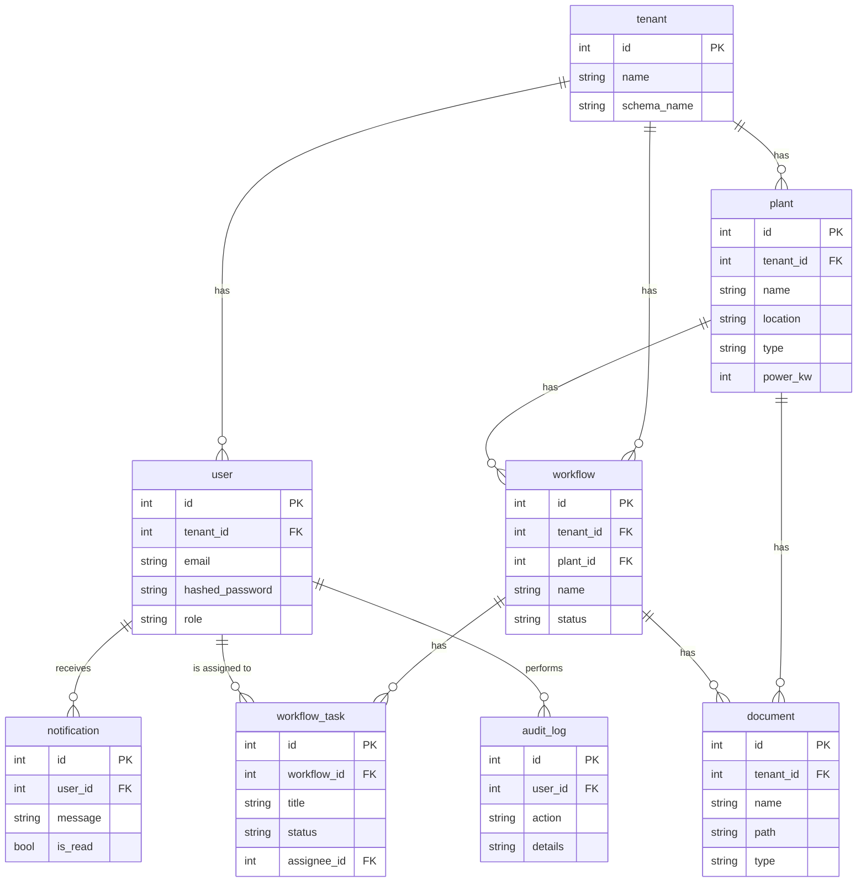

# 8. Database Schema

This document provides a detailed overview of the PostgreSQL database schema used by the Kronos EAM solution. The schema is managed by SQLAlchemy and Alembic, and is designed to be scalable, maintainable, and secure.

## 8.1. ER Diagram

## 8.2. Table Descriptions

### `tenant`

Stores information about the different tenants in the multi-tenant system.

| Column        | Type      | Description                   |
|---------------|-----------|-------------------------------|
| `id`          | `integer` | **Primary Key**               |
| `name`        | `string`  | The name of the tenant.       |
| `schema_name` | `string`  | The name of the tenant's schema in the database. |

### `user`

Stores user accounts and their associated roles and permissions.

| Column            | Type      | Description                   |
|-------------------|-----------|-------------------------------|
| `id`              | `integer` | **Primary Key**               |
| `tenant_id`       | `integer` | Foreign key to the `tenant` table. |
| `email`           | `string`  | The user's email address.     |
| `hashed_password` | `string`  | The user's hashed password.   |
| `role`            | `string`  | The user's role (e.g., `admin`, `user`). |

### `plant`

Stores information about the renewable energy plants.

| Column     | Type      | Description                   |
|------------|-----------|-------------------------------|
| `id`       | `integer` | **Primary Key**               |
| `tenant_id`| `integer` | Foreign key to the `tenant` table. |
| `name`     | `string`  | The name of the plant.        |
| `location` | `string`  | The location of the plant.    |
| `type`     | `string`  | The type of plant (e.g., `solar`, `wind`). |
| `power_kw` | `integer` | The power output of the plant in kW. |

### `workflow`

Stores information about the workflows.

| Column     | Type      | Description                   |
|------------|-----------|-------------------------------|
| `id`       | `integer` | **Primary Key**               |
| `tenant_id`| `integer` | Foreign key to the `tenant` table. |
| `plant_id` | `integer` | Foreign key to the `plant` table. |
| `name`     | `string`  | The name of the workflow.     |
| `status`   | `string`  | The current status of the workflow. |

### `workflow_task`

Stores information about the tasks within a workflow.

| Column        | Type      | Description                   |
|---------------|-----------|-------------------------------|
| `id`          | `integer` | **Primary Key**               |
| `workflow_id` | `integer` | Foreign key to the `workflow` table. |
| `title`       | `string`  | The title of the task.        |
| `status`      | `string`  | The current status of the task. |
| `assignee_id` | `integer` | Foreign key to the `user` table. |

### `document`

Stores information about the documents.

| Column    | Type      | Description                   |
|-----------|-----------|-------------------------------|
| `id`      | `integer` | **Primary Key**               |
| `tenant_id`| `integer` | Foreign key to the `tenant` table. |
| `name`    | `string`  | The name of the document.     |
| `path`    | `string`  | The path to the document in the file store. |
| `type`    | `string`  | The type of document (e.g., `pdf`, `docx`). |
