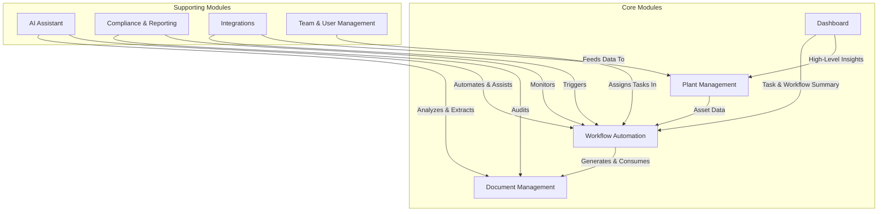
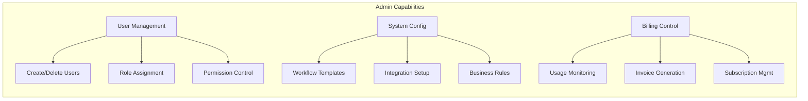
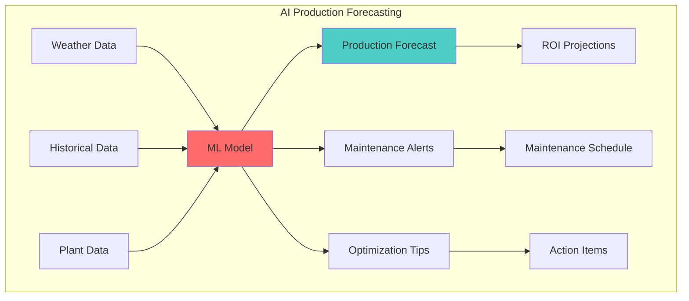

# 5. Key Features

Kronos EAM is a comprehensive Enterprise Asset Management solution designed to streamline the entire lifecycle of renewable energy assets. This document provides a detailed overview of its key features and modules.

## 5.1. Feature Overview Diagram

## 5.2. Core Modules

### 5.2.1. Dashboard

The Dashboard serves as the central hub for the entire application, providing a high-level, real-time overview of all assets and operations.

*   **Key Metrics**: At-a-glance view of critical KPIs, such as total power output, number of active plants, and overdue tasks.
*   **Recent Activity**: A live feed of recent activities, including workflow updates, document uploads, and system notifications.
*   **Compliance Status**: A summary of the overall compliance status of the asset portfolio, with alerts for any upcoming deadlines or issues.

### 5.2.2. Plant Management

The Plant Management module is the heart of the Kronos EAM solution, providing a comprehensive set of tools for managing renewable energy assets.

*   **Centralized Registry**: A complete, filterable list of all plants, with key information such as location, power output, and status.
*   **Detailed Plant View**: A dedicated page for each plant with detailed information about its technical specifications, performance data, maintenance history, and associated documents.
*   **Performance Analytics**: Interactive charts and graphs that visualize the performance of each plant over time, with metrics such as production, availability, and capacity factor.

### 5.2.3. Workflow Automation

The Workflow Automation module is a powerful, flexible system for creating, managing, and automating the complex processes involved in renewable energy asset management.

*   **Workflow Templates**: A library of pre-built templates for common workflows, such as new plant connections, compliance checks, and maintenance routines.
*   **Customizable Workflows**: The ability to create custom workflows from scratch or by modifying existing templates to fit specific needs.
*   **Task Management**: A comprehensive task management system with support for assignments, deadlines, dependencies, and audit trails.

### 5.2.4. Document Management

The Document Management module provides a secure, centralized repository for all documents related to plants and workflows.

*   **Secure File Storage**: All documents are stored securely, with support for version control and access permissions.
*   **AI-Powered Extraction**: The system uses AI to automatically extract key information from uploaded documents, reducing manual data entry.
*   **Smart Search**: A powerful search engine that allows users to find documents based on keywords, metadata, or even the content of the document itself.

## 5.3. Supporting Modules

### 5.3.1. AI Assistant

The AI Assistant is an intelligent agent that helps users with a variety of tasks, from answering questions to automating complex workflows.

*   **Natural Language Interface**: Users can interact with the AI Assistant using natural language, making it easy to get information and perform actions.
*   **Proactive Assistance**: The AI Assistant can proactively identify potential issues and suggest actions to resolve them.
*   **Automated Reporting**: The AI Assistant can automatically generate reports and summaries based on user requests.

### 5.3.2. Compliance & Reporting

The Compliance & Reporting module provides a set of tools for ensuring that all assets are in compliance with regulatory requirements.

*   **Compliance Checklists**: Customizable checklists that help users track the compliance status of each plant.
*   **Automated Alerts**: The system automatically sends alerts for upcoming deadlines and potential compliance issues.
*   **Customizable Reports**: A powerful report builder that allows users to create custom reports on any aspect of their asset portfolio.

## 5.4. Features by User Role

Kronos EAM provides tailored functionality for each user type, ensuring everyone has the tools they need:

### 5.4.1. Administrator Features

- **Multi-tenant Management**: Configure and manage multiple organizations from a single interface
- **Advanced User Management**: Bulk user creation, role templates, permission inheritance
- **System Customization**: Create custom workflows, forms, and approval chains
- **API Management**: Generate API keys, set rate limits, monitor usage
- **Billing Dashboard**: Real-time usage metrics, cost allocation, invoice generation

### 5.4.2. Energy Manager Features

- **Portfolio Dashboard**: Comprehensive view of all managed plants with key KPIs
- **Compliance Matrix**: Visual representation of compliance status across portfolio
- **Advanced Analytics**: Performance benchmarking, trend analysis, predictive insights
- **Report Automation**: Scheduled reports for stakeholders with custom templates
- **Strategic Planning Tools**: What-if scenarios, optimization recommendations

### 5.4.3. Technician Features

- **Mobile-First Interface**: Optimized for tablet and smartphone use in the field
- **Offline Mode**: Continue working without internet connection, sync when online
- **Task Queue**: Prioritized task list with GPS navigation to plant locations
- **Document Scanner**: OCR-enabled document capture with automatic categorization
- **Quick Actions**: One-tap updates for common field operations

### 5.4.4. Plant Owner Features

- **Executive Dashboard**: High-level view of plant performance and compliance
- **Cost Analytics**: Detailed breakdown of compliance costs and savings
- **Document Repository**: Secure access to all plant documentation and certificates
- **Alert Management**: Customizable notification preferences and escalation rules
- **Performance Reports**: Monthly/quarterly reports on plant operations

## 5.5. Upcoming Features

### 5.5.1. Plant Production Estimation (Coming Soon)

**Key Features:**
- **AI-Powered Forecasting**: Advanced machine learning model trained on Italian renewable energy data
- **Weather Integration**: Real-time weather data analysis for accurate predictions
- **Historical Performance Analysis**: Learn from past performance patterns
- **Predictive Maintenance**: Anticipate issues before they impact production
- **ROI Optimization**: Recommendations to maximize return on investment
- **Scenario Planning**: What-if analysis for different weather conditions
- **Grid Integration**: Predict best times for energy sales based on market conditions

### 5.5.2. Q1 2025 Releases

- **Mobile Application**: Native iOS and Android apps with full offline capability
- **Advanced Analytics Dashboard**: Custom KPIs, trend analysis, performance benchmarking
- **Automated Report Builder**: Drag-and-drop report creation with scheduling

### 5.5.3. Q2 2025 Features

- **AI Compliance Assistant**: Natural language interface for compliance queries
- **Enterprise Integrations**: SAP, Oracle, Microsoft Dynamics connectors
- **Multi-language Support**: German, Spanish, French interfaces

### 5.5.4. Q3 2025 Innovation

- **Blockchain Integration**: Immutable audit trails and document verification
- **Developer Platform**: API marketplace and plugin system
- **Predictive Compliance**: ML-based deadline and risk predictions
