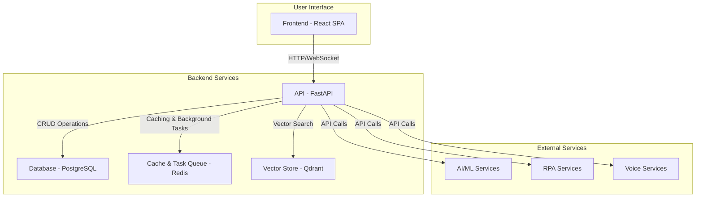

# 1. Overview

## 1.1. Introduction

Kronos EAM is a comprehensive Enterprise Asset Management solution designed for the renewable energy sector. It provides a full suite of tools for managing plants, workflows, documents, and compliance, with a focus on automation and AI-powered assistance.

The platform is engineered to streamline operations, reduce administrative overhead, and provide actionable insights into the performance and compliance of renewable energy assets.

## 1.2. Architecture

The solution is architected as a modern web application with a distinct frontend and backend, supported by a suite of containerized services. This separation of concerns allows for independent development, scaling, and deployment of each component.

### 1.2.1. High-Level Architecture Diagram

### 1.2.2. Component Descriptions

*   **Frontend**: A responsive single-page application (SPA) built with **React** and **TypeScript**. It leverages Material-UI for its component library and Tailwind CSS for styling. The application is fully internationalized with `i18next`.
*   **Backend**: A robust API built with **Python** and the **FastAPI** framework. It uses a **PostgreSQL** database for data storage, **Redis** for caching and task queuing, and **Qdrant** for vector search.
*   **Services**: The backend integrates with a number of services, including AI/ML services for intelligent document processing, voice services for audio transcription, and RPA for automating interactions with external portals.
