# 1. Overview

## 1.1. The Challenge

Managing renewable energy assets in Italy involves navigating a complex web of bureaucratic requirements across multiple government agencies. Plant operators must interact with:

- **Terna** (GAUDÌ system) for grid connection and plant registration
- **GSE** (Energy Services Manager) for incentive management and conventions
- **DSO** (Distribution System Operators) for connection requests and technical compliance
- **Agenzia delle Dogane** (Customs Agency) for electric workshop licenses
- **Local Authorities** for permits and authorizations

Each interaction has strict deadlines, complex procedures, and severe penalties for non-compliance. Missing a single deadline can result in thousands of euros in fines or loss of incentives.

## 1.2. Our Solution

**Kronos EAM** is a cloud-native SaaS platform that transforms how renewable energy assets are managed in Italy. We provide a comprehensive Enterprise Asset Management solution that serves multiple user roles:

### Platform Users

### Key Capabilities

- **🚀 Smart Compliance Assistant**: 80% reduction in manual administrative work
- **📅 Proactive Deadline Management**: Never miss another compliance deadline
- **📊 Centralized Asset Registry**: Single source of truth for all plant documentation
- **🤖 Intelligent Automation**: Automated data extraction and form pre-filling

The platform is engineered to streamline operations, reduce administrative overhead, and provide actionable insights into the performance and compliance of renewable energy assets for all stakeholders involved.

## 1.3. Solution Architecture

The solution is architected as a modern web application with a distinct frontend and backend, supported by a suite of containerized services. This separation of concerns allows for independent development, scaling, and deployment of each component.

### 1.3.1. Solution Flow

```mermaid
graph LR
    subgraph "Kronos EAM Solution - Unified Collaboration"
        Admin2[Administrator] -->|Configures| K[Kronos EAM Platform]
        EM2[Energy Manager] -->|Monitors| K
        Tech2[Technician] -->|Updates| K
        Owner2[Plant Owner] -->|Views| K
        
        K -->|Automated| T2[Terna API]
        K -->|Smart Forms| G2[GSE Portal]
        K -->|B2B Integration| D2[DSO Systems]
        K -->|EDI Generation| A2[Agenzia Dogane]
        
        K -->|Manages| CAL[Smart Calendar]
        K -->|Stores| DOC[Document Vault]
        K -->|Tracks| AUD[Audit Trail]
        
        CAL -->|Alerts All Users| OK[✓ Compliance]
        DOC -->|Shared Access| OK
        AUD -->|Full Transparency| OK
        
        Admin2 -.->|Full Control| OK
        EM2 -.->|Analytics| OK
        Tech2 -.->|Mobile Access| OK
        Owner2 -.->|Real-time View| OK
    end
    
    style Admin2 fill:#e74c3c
    style EM2 fill:#3498db
    style Tech2 fill:#2ecc71
    style Owner2 fill:#f39c12
    style K fill:#4ecdc4
    style OK fill:#95e1d3
    style CAL fill:#f6e58d
    style DOC fill:#7bed9f
```

### 1.3.2. High-Level Architecture Diagram

### 1.3.3. Component Descriptions

*   **Frontend**: A responsive single-page application (SPA) built with **React** and **TypeScript**. It leverages Material-UI for its component library and Tailwind CSS for styling. The application is fully internationalized with `i18next`.
*   **Backend**: A robust API built with **Python** and the **FastAPI** framework. It uses a **PostgreSQL** database for data storage, **Redis** for caching and task queuing, and **Qdrant** for vector search.
*   **Services**: The backend integrates with a number of services, including AI/ML services for intelligent document processing, voice services for audio transcription, and RPA for automating interactions with external portals.
